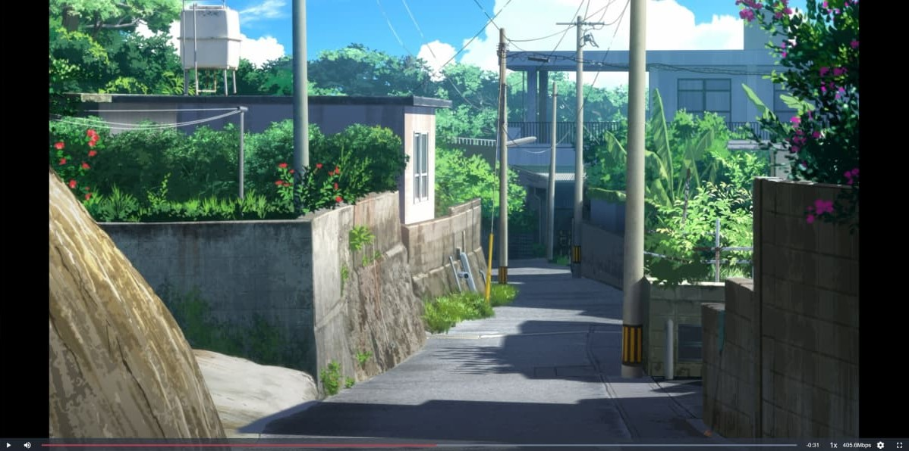

HamiVideo 影劇館的播放器底下會有奇怪的留白，於是開始改進他的介面

## 調整項目

- 將播放介面設為全螢幕
- 取消分級告示畫面
- 自動隱藏 Chromecast 按鈕
- 進度條更換顏色
- 移除進度條及音量條上圓點
- 啟用快速鍵

## Screenshot

## 安裝腳本

https://greasyfork.org/zh-TW/scripts/430761-make-hamivideo-better
